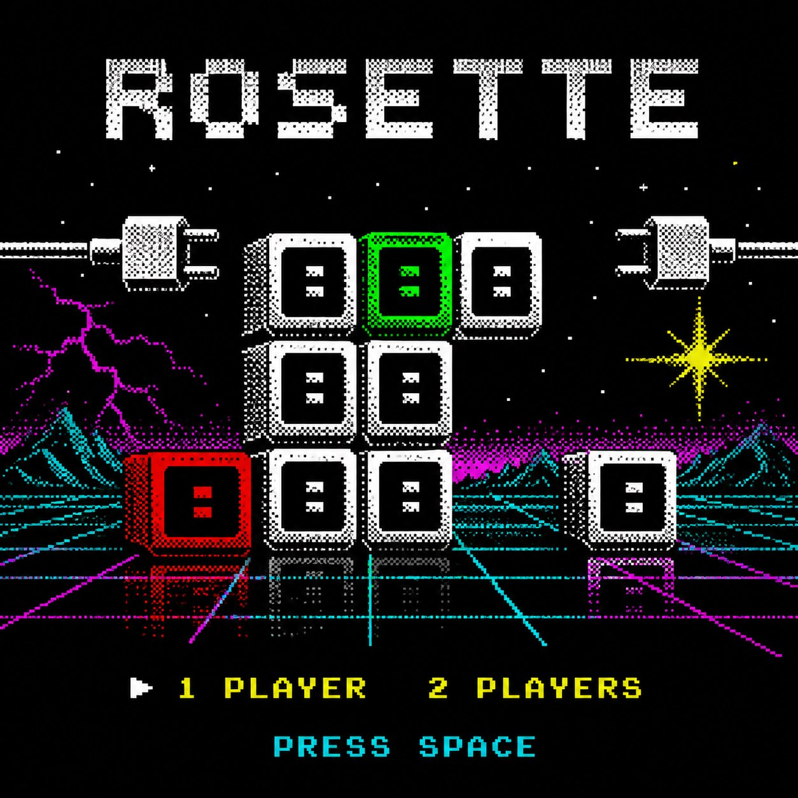

# 🕹️ ROSETTE — 8-bit 

Увлекательная 8-битная игра, разработанная с использованием современных веб-технологий и упакованная как полноценное десктопное приложение для Windows.

---

## 🚀 Скачать и установить

Вы можете скачать готовый установщик игры для Windows в разделе [**Releases**](https://github.com/styazhkoV/rosette/releases):

1.  Перейдите в раздел **Releases** справа на странице репозитория.
2.  Скачайте файл ROSETTE Setup 1.0.0.exe.
3.  Запустите его для установки игры на ваш ПК.

---

## 💻 Технологии проекта

Проект создан на базе следующих инструментов:
*   **HTML / CSS / JavaScript** — игровая логика и интерфейс.
